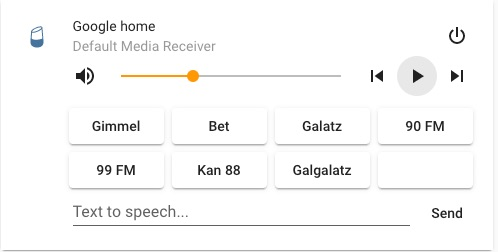

# Chromecast radio player card

*Please :star: this repo if you find it useful*

Lovelace card with pre-defined Israel radio station buttons to play on Chromecast device.

## Prerequisites

- [Mini media player](https://github.com/kalkih/mini-media-player)
- [Decluttering card](https://github.com/custom-cards/decluttering-card)

## Scripts

```yaml
script:
  media_player_play_radio_stream:
    sequence:
      - service: media_player.play_media
        data_template:
          entity_id: "{{ entity_id }}"
          media_content_id: >
            
              http://kanliveicy.media.kan.org.il/icy/kangimmel_mp3?providername=tunein
            
              http://kanliveicy.media.kan.org.il/icy/kan88_mp3?providername=tunein
            
              http://kanliveicy.media.kan.org.il/icy/kanbet_mp3?providername=tunein
            
              https://glzwizzlv.bynetcdn.com/glglz_mp3?awCollectionId=misc&awEpisodeId=glglz
            
              http://glzwizzlv.bynetcdn.com/glz_mp3?awCollectionId=misc&awEpisodeId=glz
            
              https://eco-live.mediacast.co.il/99fm_aac?.m4a&listenerid=066aae8a4c886b90398e894d0978f2f8&awparams=companionAds%3Atrue
            
              https://icy.streamgates.net/Radio_CDN/Emtza_Haderech/icecast.audio
            
          media_content_type: audio/mp3
```

**Note**: streaming urls might change in the future.

## Templates

Media player card template with pre deffined radio stationnames.

```yaml
decluttering_templates:
  template_media_player_chromecast:
    card:
      type: custom:mini-media-player
      entity: '[[entity_id]]'
      group: false
      tts:
        platform: google_translate
      hide:
        # power: true
        progress: true
      shortcuts:
        columns: 4
        buttons:
          - name: Gimmel
            type: script
            id: script.media_player_play_radio_stream
            data:
              entity_id: '[[entity_id]]'
              content_id: Kan Gimmel
          - name: Bet
            type: script
            id: script.media_player_play_radio_stream
            data:
              entity_id: m'[[entity_id]]'
              content_id: Kan Bet
          - name: Galatz
            type: script
            id: script.media_player_play_radio_stream
            data:
              entity_id: '[[entity_id]]'
              content_id: Galei Zahal
          - name: 90 FM
            type: script
            id: script.media_player_play_radio_stream
            data:
              entity_id: '[[entity_id]]'
              content_id: Radio 90 FM
          - name: 99 FM
            type: script
            id: script.media_player_play_radio_stream
            data:
              entity_id: '[[entity_id]]'
              content_id: Echo 99 FM
          - name: Kan 88
            type: script
            id: script.media_player_play_radio_stream
            data:
              entity_id: '[[entity_id]]'
              content_id: KAN 88
          - name: Galgalatz
            type: script
            id: script.media_player_play_radio_stream
            data:
              entity_id: '[[entity_id]]'
              content_id: GLGLZ
          - id: script.media_player_play_radio_stream
            type: source
```

## Lovelace

Set your media player entity id

```yaml
.
.
.
  type: vertical-stack
  cards:
    - type: custom:decluttering-card
      template: template_media_player_chromecast
      variables:
        - entity_id: media_player.< media player id>
```



---

I put a lot of work into making this repo and component available and updated to inspire and help others! I will be glad to receive thanks from you — it will give me new strength and add enthusiasm:
<p align="center"><br>
<a href="https://paypal.me/eyalco1967?locale.x=he_IL" target="_blank"></a>
</p>