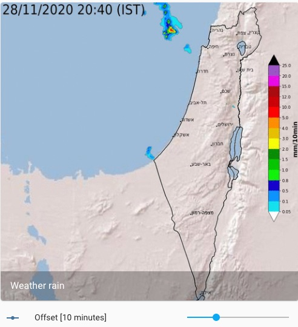

# Israel rain radar

For a view of irsael rain radar, we will use [generic camera](https://www.home-assistant.io/integrations/generic/) with still image URL.
For changing the time offset of the image, we will use [input number](https://www.home-assistant.io/integrations/input_number/). The input number (time offset) can be set using UI or using input number [services](https://www.home-assistant.io/integrations/input_number/#services).



## Entities

The camera uses template to define the image URL. The template creates the time stamp of the image based on the current time and the offset set by the input number.
Note that the refresh rate of the image is based on the refresh rate of the entity card, so there is a delay between changin the time offset and the time the image is updated.

```yaml
camera:
  platform: generic
  name: Weather rain
  content_type: image/gif
  limit_refetch_to_url_change: true
  still_image_url: >
    
    {% set timestamp = (as_timestamp(now()) - offset_seconds) | timestamp_custom('%Y%m%d%H%M', True) | regex_replace(find='(?<=\d{11})\d', replace='0') %}
    https://ims.gov.il/sites/default/files/ims_data/map_images/radar/radar_{{timestamp}}.gif
```

Input number for time offset:

```yaml
input_number:
  weather_rain_offset:
    name: Offset
    min: 0
    max: 14
    step: 1
```

## Lovelace

```yaml
cards:
  - type: picture-entity
    entity: camera.weather_rain
    show_state: false
  - type: entities
    entities:
      - entity: input_number.weather_rain_offset
```

**Note**: For slider, you can also use the custom [slider entity row](https://github.com/thomasloven/lovelace-slider-entity-row) which gives more control on the card.

---

I put a lot of work into making this repo and component available and updated to inspire and help others! I will be glad to receive thanks from you — it will give me new strength and add enthusiasm:
<p align="center"><br>
<a href="https://paypal.me/eyalco1967?locale.x=he_IL" target="_blank"></a>
</p>