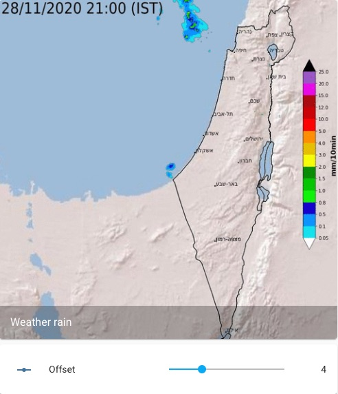

# Israel rain radar

For a view of irsael rain radar, we will use [generic camera](https://www.home-assistant.io/integrations/generic/) with still image URL.
For changing the time offset of the image, we will use [input number](https://www.home-assistant.io/integrations/input_number/). The input number (time offset) can be set using UI or using input number [services](https://www.home-assistant.io/integrations/input_number/#services).



The camera uses template to define the image URL

```yaml
camera:
  platform: generic
  name: Weather rain
  content_type: image/gif
  limit_refetch_to_url_change: true
  still_image_url: >
    
    {% set timestamp = (as_timestamp(now()) - offset_seconds) | timestamp_custom('%Y%m%d%H%M', True) | regex_replace(find='(?<=\d{11})\d', replace='0') %}
    https://ims.gov.il/sites/default/files/ims_data/map_images/radar/radar_{{timestamp}}.gif
```

Input number for time offset:

```yaml
input_number:
  weather_rain_offset:
    name: Offset
    min: 0
    max: 14
    step: 1
```
