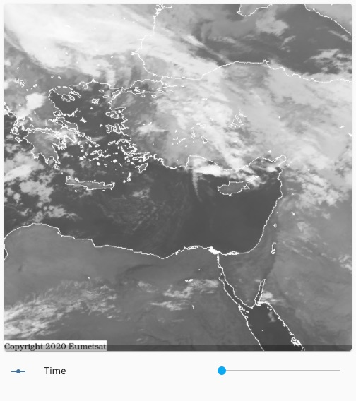

# Israel satellite radar

*Please :star: this repo if you find it useful*

For a view of Israel satellite radar, we will use [generic camera](https://www.home-assistant.io/integrations/generic/) with still image URL.
For changing the time offset of the image, we will use [input number](https://www.home-assistant.io/integrations/input_number/). The input number (time offset) can be set using UI or using input number [services](https://www.home-assistant.io/integrations/input_number/#services).

Note that the refresh rate of the image is based on the refresh rate of the entity card, so there is a delay until the image is updated after changing the time offset.



## Entities

The camera uses template to define the image URL. The template creates the time stamp of the image based on the current time and the offset set by the input number.


```yaml
camera:
  platform: generic
  name: Weather satellite
  content_type: image/gif
  limit_refetch_to_url_change: true
  still_image_url: >
    
    {% set timestamp = (as_timestamp(now()) - offset_seconds) | timestamp_custom('%Y%m%d%H00', True)  %}
    https://ims.gov.il/sites/default/files/ims_data/map_images/satellite/satellite_{{timestamp}}_MIDDLE-EAST.jpeg
```

Input number for time offset:

```yaml
input_number:
  weather_satellite_offset:
    name: Offset
    min: 0
    max: 12
    step: 1
```

## Lovelace

```yaml
type: vertical-stack
cards:
  - type: picture-glance
    camera_image: camera.weather_satellite
    show_info: true
    entities: []
  - type: custom:slider-entity-row
    name: Time
    entity: input_number.weather_satellite_offset
    hide_state: true
```

**Note**: For slider, you can also use the custom [slider entity row](https://github.com/thomasloven/lovelace-slider-entity-row) which gives more control on the card.

---

I put a lot of work into making this repo and component available and updated to inspire and help others! I will be glad to receive thanks from you — it will give me new strength and add enthusiasm:
<p align="center"><br>
<a href="https://paypal.me/eyalco1967?locale.x=he_IL" target="_blank"></a>
</p>