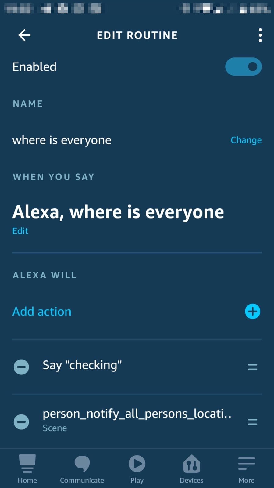

# Where is everyone

## Required services

For person location, [Life360](https://www.life360.com/intl/) with the Home Assistant [Life360](https://www.home-assistant.io/integrations/life360/) integration.

For voice assistant, Amazon echo device with Home Assistant [Alexa media player](https://github.com/custom-components/alexa_media_player) integration.

You need also to expose the **where is everyone** script to Alexa smart home. Alexa Cloud integration via [Nabu Casa](https://www.nabucasa.com/) is an easy way for all (or selected) HA entities or scripts to be exposed to your Alexa app.

## Entities

Add your family [persons](https://www.home-assistant.io/integrations/person/). Use the device tracker assosicated with each person.

```yaml
person:
  - name: Person1
    id: person1
    device_trackers:
      - device_tracker.life360_...
  - name: Person2
    id: person2
    device_trackers:
      - device_tracker.life360_...
```

Add all family member to persons [group](https://www.home-assistant.io/integrations/group/):

```yaml
group:
  all_persons:
    name: All persons
    entities:
      - person.person1
      - person.person2
```

Add your known [zones](https://www.home-assistant.io/integrations/zone):

```yaml
zone:
  - name: Gym
    latitude: 35.569649
    longitude: 42.9333286
    radius: 50
    icon: mdi:map-marker
```

And a sensor which will get the last activated alexa device.

```yaml
sensor:
  - platform: template
    sensors:
      alexa_last:
        value_template: >
          {{ states.media_player | selectattr('attributes.last_called','eq',True) | map(attribute='entity_id') | first }}
```

## Customization

Use [customization](https://www.home-assistant.io/docs/configuration/customizing-devices/) to set persons ```friendly_name```. The friendly name is used when building the response message.

```yaml
person.person1:
  friendly_name: John
person.person2:
  friendly_name: Julia
```

## Scripts

The following script sends a notification message to the last activated Alexa device.

```yaml
script:
  notify_voice_last:
    alias: Notify voice last
    sequence:
      - service: notify.alexa_media
        data_template:
          target: "{{ states('sensor.alexa_last') }}"
          data:
            type: announce
          message: "{{ message }}"
```

The notify script iterates all family persons, and build the text response that will be sent to the last activated device. Note that the person name is taken from the person ```friendly_name``` attribute.

```yaml
script:
  person_notify_all_persons_location:
    sequence:
      - service: script.notify_voice_last
        data_template:
          message: >
            
            
            
            
            
              
            
              
            
              
            
            
            {{ns.say}}
```

## Discover Devices

Before you create the [rountine](https://www.amazon.com/gp/help/customer/display.html?nodeId=202200080), you need Alexa to discover the person notification script. After [adding](https://www.nabucasa.com/config/amazon_alexa/) the script to the scripts shown to alexa, just say "Alexa, discover devices", and wait until the new script is being discovered.

## Routines

To be able to ask Alexa **where is everyone**, you will need to add a routine that will trigger the Home Assistant script. Use the Alexa App in your mobile device to define the rountine.



---

I put a lot of work into making this repo and component available and updated to inspire and help others! I will be glad to receive thanks from you — it will give me new strength and add enthusiasm:
<p align="center"><br>
<a href="https://paypal.me/eyalco1967?locale.x=he_IL" target="_blank"></a>
</p>